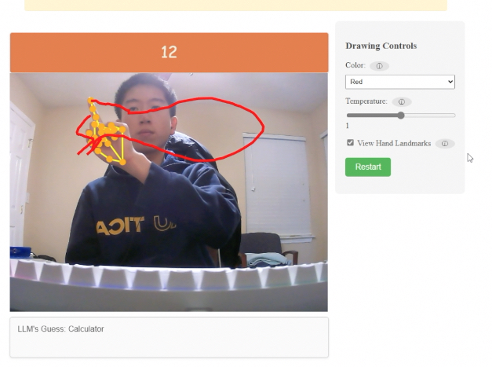

# Air Draw



[Video Demo](https://youtu.be/FshbCPUwbmM)

## Description

This project is an interactive AI-themed demonstration for Engineering Day at the University of Kentucky in 2025. Its purpose is to expose K-12 to AI concepts and sparks inspirations in them. The idea is to recreate the "Quick, Draw!" game from Google with a different way to draw and recognize the doodle. Instead of drawing with your fingers on a screen, you will "draw in the air".

### Game Instructions

Click on start to begin the game. You will need to give your browser permission to access your webcam. Simply face your webcam and face your right hand with your index finger pointing up to the webcam and start drawing! Your doodle will be recognized by an LLM every 2 seconds or so, if the LLM guesses right then you win! You will need to make the LLM guess right under 20 seconds!

## Installation

### Steps

1. Clone the repository:
   ```bash
   git clone https://github.com/JaMussCraft/E-Day-2025
   ```
2. Install the dependencies:
   ```bash
   npm install
   ```
3. Replace the `apiKey` variable in `script.js` with your OpenAI API key
    ```js
    const apiKey = <your-api-key>
    ```

## Usage

### Running the Project

1. Start the development server:
   ```bash
   npm run dev
   ```

## Future Ideas

- Add more parameters and customization to the LLM
- Make drawing experience more precise and seamless
- Ability to change color with gestures
- Ability to erase
- Train my own model on the Quick Draw dataset instead of using LLM api
- Interface Air Draw on top of Quick Draw
- https://github.com/magenta/magenta-demos/tree/main

## Inspirations & Acknowledgements

- [Quick, Draw!](https://quickdraw.withgoogle.com/)
- [Teachable Machine](https://teachablemachine.withgoogle.com/)
- [MediaPipe Studio Models](https://mediapipe-studio.webapps.google.com/home)

## Contributions

Contributions are welcome! Please follow these steps to contribute:

1. Fork the repository.
2. Create a new branch (`git checkout -b feature-branch`).
3. Make your changes and commit them (`git commit -m 'Add new feature'`).
4. Push to the branch (`git push origin feature-branch`).
5. Create a new Pull Request.

## Contact

Author: James Wong

- [LinkedIn](https://www.linkedin.com/in/singhiengwong/)
- [GitHub](https://github.com/JaMussCraft)
- Email: shwo225@uky.edu
